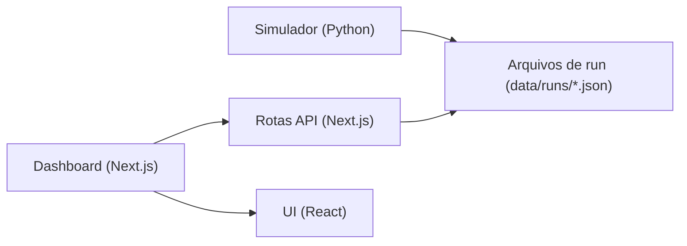
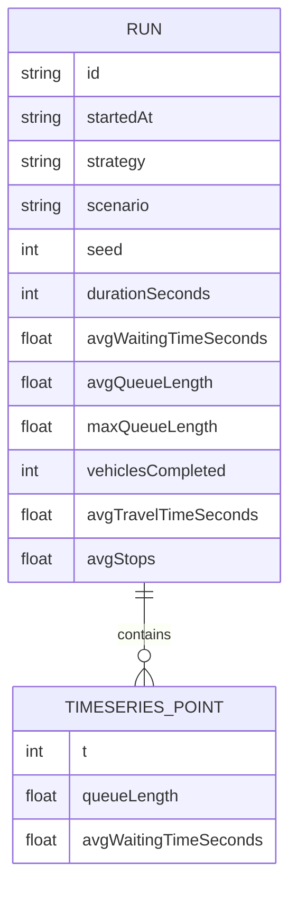

## 1. Desenho de Arquitetura

## 2. Descrição de Tecnologia
- Simulador: Python (execução local), integração com SUMO via CLI/TraCI, saída em JSON por run
- Dashboard: Next.js (App Router) + React + TypeScript
- Estilização: Tailwind CSS
- Persistência: arquivos JSON em `data/runs/` (sem banco no MVP 1)

## 3. Definições de Rotas (Dashboard)
| Rota | Propósito |
|---|---|
| / | Comparação de duas execuções (A/B) com cards de métricas e gráfico |
| /runs | Lista e filtros de runs existentes, com ações “usar como A/B” |
| /runs/[id] | Detalhe de um run (metadados, métricas agregadas, séries temporais) |

## 4. Definições de API (Next.js Route Handlers)
| Endpoint | Método | Retorno | Descrição |
|---|---:|---|---|
| /api/runs | GET | RunSummary[] | Lista runs disponíveis (ordenado por data) |
| /api/runs/[id] | GET | Run | Carrega um run completo (metadados, métricas e série temporal) |

Tipos (referência em TypeScript):
- `RunSummary`: { id, startedAt, strategy, scenario, seed, durationSeconds }
- `Run`: `RunSummary` + { metrics, timeseries }

## 5. Modelo de Dados (JSON do Run)

Estrutura recomendada do arquivo:
- `meta`: id, startedAt, strategy, scenario, seed, durationSeconds
- `metrics`: agregados
- `timeseries`: lista de pontos com `t` (segundos) e valores (ex.: fila)

## 6. Convenções de Diretórios
- `apps/simulator`: cenário SUMO, controladores, coletor de métricas, CLI
- `apps/web`: dashboard Next.js
- `data/runs`: outputs (JSON) gerados pelo simulador

## 7. Considerações de Execução Local
- O dashboard lê `data/runs` do filesystem em tempo de execução no servidor do Next.js (dev/prod local)
- Não há autenticação nem multiusuário no MVP 1
