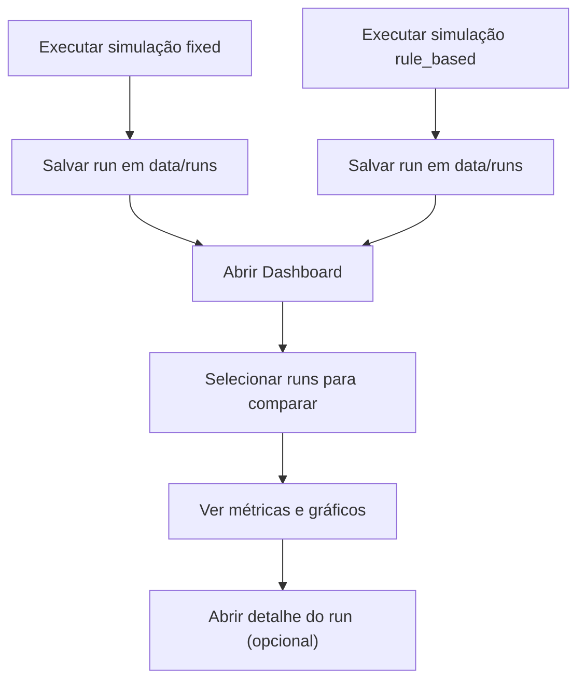

## 1. Visão Geral do Produto
SmartSignal Lab (MVP 1) é um laboratório local para simular um cruzamento simples no SUMO e comparar estratégias de controle semafórico (fixo vs rule-based), exibindo métricas e gráficos em um dashboard web.
- Usuários-alvo: pessoas de engenharia de tráfego, pesquisa e demonstrações técnicas que precisam comparar rapidamente estratégias em um cenário pequeno e repetível
- Valor: execução reprodutível, métricas salvas por “run” e comparação visual rápida sem depender de IA

## 2. Funcionalidades Centrais

### 2.1 Módulos do Produto
1. **Simulador (CLI em Python)**: executa o SUMO (GUI ou headless), aplica estratégia de controle, coleta métricas e salva resultados por run
2. **Dashboard Web**: lista runs salvos, compara estratégias e visualiza série temporal (fila ao longo do tempo)

### 2.2 Detalhamento por Página
| Página | Módulo | Descrição da funcionalidade |
|---|---|---|
| Dashboard | Seleção de runs | Selecionar 1 run “fixed” e 1 run “rule_based” (ou escolher automaticamente o par mais recente) |
| Dashboard | Cards de métricas | Mostrar principais métricas por estratégia e um resumo comparativo (diferença/percentual) |
| Dashboard | Gráfico temporal | Plotar fila ao longo do tempo (uma ou duas linhas) a partir da série temporal salva no run |
| Runs | Lista de runs | Listar runs existentes (data/hora, estratégia, seed, duração, cenário) com busca/filtro por estratégia |
| Runs | Ações | Abrir detalhes do run e/ou definir como “lado A” ou “lado B” para comparação |
| Run (Detalhe) | Metadados + métricas | Mostrar parâmetros do run, métricas agregadas, e acesso ao JSON bruto |
| Run (Detalhe) | Séries temporais | Mostrar gráfico(s) do run único (ex.: fila, espera) ao longo do tempo |

## 3. Processo Principal
Fluxo típico do usuário:
1. Rodar duas simulações (fixo e rule-based) para o mesmo cenário/seed
2. Abrir o dashboard e selecionar runs (ou usar o par mais recente)
3. Analisar cards e gráfico de fila ao longo do tempo
4. Explorar detalhes de um run específico para auditoria/diagnóstico

## 4. Design da Interface
### 4.1 Estilo Visual
- Direção: “laboratório editorial” (dark + alto contraste) com tipografia de caráter técnico e layout em grade
- Cores: fundo escuro, neutros frios, acentos (ex.: âmbar para fixed, ciano para rule_based) consistentes em cards e linhas do gráfico
- Componentes: cards com bordas finas, separadores, estados de seleção claros e micro-interações discretas
- Tipografia: uma fonte display (títulos) + uma fonte de leitura (corpo), evitando padrões genéricos

### 4.2 Visão Geral por Página
| Página | Módulo | Elementos de UI |
|---|---|---|
| Dashboard | Comparação | Header com seletor “A/B”, cards com KPIs, gráfico com legenda e tooltip |
| Runs | Lista | Tabela/Lista com filtros, chips por estratégia, botões “Comparar como A/B” |
| Run (Detalhe) | Auditoria | Seção de metadados, cards de métricas, gráfico, botão para baixar/abrir JSON |

### 4.3 Responsividade
- Desktop-first
- Layout em 2 colunas no desktop (cards + gráfico) e empilhamento no mobile
- Controles de seleção com áreas de toque amplas no mobile
